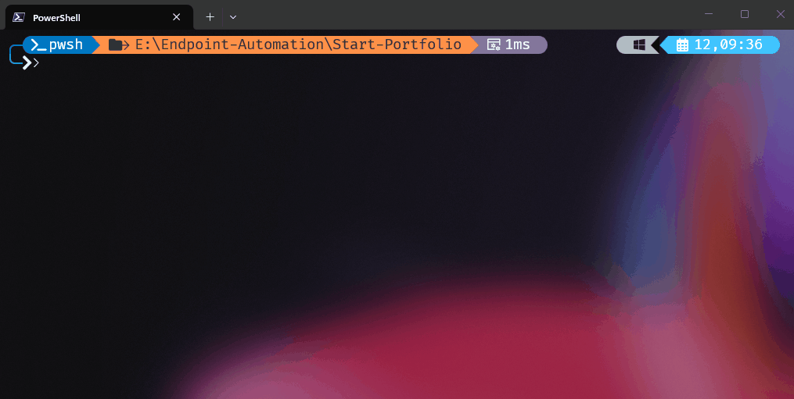

# David R. Cushman | Endpoint Engineering Portfolio

[Project Index](./projects/README.md) · [Project Selection Criteria](./docs/project-selection.md) · [Portfolio Roadmap](./docs/portfolio-roadmap.md)

Senior Endpoint Engineer focused on PowerShell automation, endpoint management, and platform reliability across enterprise environments.

This portfolio shows how I approach engineering work that has to stay reliable, maintainable, and reviewable over time. It brings together reusable PowerShell development foundations, applied endpoint and automation projects, and the documentation that explains the constraints and decisions behind them.

## What This Portfolio Demonstrates

- reusable PowerShell engineering foundations for both PowerShell 7 and Windows PowerShell 5.1
- applied endpoint and automation projects shaped by real operational constraints
- AI-assisted engineering governed through explicit guidance, validation, review, and maintenance workflows

In practical terms, the portfolio works in three layers: this landing repo explains the overall approach, the template repos define the engineering baseline, and downstream project repos show that baseline applied to real work.

## How I Use AI

I treat AI as a drafting accelerator, not as a substitute for engineering judgment.

A meaningful part of my work is defining how AI-assisted changes are constrained, reviewed, validated, and kept aligned over time. That matters because fast output is not enough on its own. The work still has to remain correct, maintainable, and trustworthy after it is produced.

That governance is not the end goal by itself. It is part of how I produce better automation, clearer standards, and more reliable outcomes.

## Background

My background includes enterprise endpoint engineering in financial services and energy infrastructure, with practical experience in:

- Configuration Manager (ConfigMgr / MECM / SCCM)
- Microsoft Intune and modern endpoint management
- Windows deployment and platform lifecycle engineering
- PowerShell automation
- Active Directory and Group Policy
- Microsoft 365, Azure, and security-aligned platform administration

Professional profile: [LinkedIn](https://www.linkedin.com/in/davidrcushman/).

## What I Build

I build endpoint and automation solutions for environments where reliability matters, operational drift is expensive, and change has to be handled deliberately.

The work I am most drawn to sits at the intersection of:

- endpoint engineering at enterprise scale
- automation that reduces operational risk
- platform modernization across on-prem and cloud-connected tooling
- documentation and process design that make systems supportable over time

My approach to engineering was shaped early by work in a role where the margin for error was effectively zero. That experience still informs how I evaluate technical work now:

- if a step is not verified, it is not complete
- automation should reduce risk, not just save time
- operational tooling should be maintainable long after the first deployment
- clear documentation preserves engineering intent, not just implementation detail

Start with the featured projects below; each case study explains the problem, constraints, implementation choices, and engineering signal behind the work.

## Featured Projects

### Foundations

#### [PowerShell Development Template: Available Anywhere](./projects/pwsh-dev-template.md)

A reusable PowerShell Core repository template with CI validation, Dev Containers, AI guardrails, ADR-backed decisions, downstream guidance sync, repo-local agent workflows, and template health reporting.

Best signal: reusable engineering standards, deterministic validation, and AI-governed maintenance workflows for modern PowerShell work.

Repository:
[pwsh-dev-template](https://github.com/david-r-cushman/pwsh-dev-template)

#### [Windows PowerShell 5.1 Development Template](./projects/powershell-dev-template.md)

A reusable repository template for Windows PowerShell 5.1 projects that need a native Windows development baseline, Windows-hosted CI, and the same testing, analysis, governance, and maintenance discipline used in the modern PowerShell template.

Best signal: runtime-aware engineering judgment for legacy and Windows-only PowerShell work without giving up validation discipline.

Repository:
[powershell-dev-template](https://github.com/david-r-cushman/powershell-dev-template)

### Applied Projects

If you want the quickest view of hands-on implementation work, start here.

#### [Uninstall-DisplayDrivers](./projects/powershell-driver-management.md)

A PowerShell script built from a real ConfigMgr deployment scenario to remove display driver packages with `devcon.exe`.

Best signal: practical ConfigMgr-oriented scripting shaped by real deployment constraints, safety guardrails, and operational reporting.

Repository:
[powershell-driver-management](https://github.com/david-r-cushman/powershell-driver-management)

#### [WinPE Deployment Lab](./projects/winpe-deployment-lab.md)

A PowerShell-driven WinPE lab for building capture and deployment media and working directly with offline WIM maintenance.

Best signal: hands-on platform depth in Windows imaging and offline servicing, with scoped automation that stays technically honest.

Repository:
[winpe-deployment-lab](https://github.com/david-r-cushman/winpe-deployment-lab)

#### [GPU Cooldown Sleep](./projects/gpu-cooldown-sleep.md)

A PowerShell module that monitors GPU temperature and can put a Windows system to sleep once a target cooldown threshold is reached.

Best signal: disciplined module design that combines hardware telemetry, safe state changes, and testable operational UX.

Repository:
[gpu-cooldown-sleep](https://github.com/david-r-cushman/gpu-cooldown-sleep)

## Why This Portfolio Exists

This repository is meant to make it easier for recruiters, hiring managers, and technical peers to quickly understand how I work.

Rather than collecting every script or experiment, I want this portfolio to highlight a smaller number of projects that clearly show:

- the problem being solved
- the operational constraints involved
- the engineering decisions and constraints behind the implementation
- the reliability and maintainability thinking behind the result

## Explore The Work

- [Portfolio Project Index](./projects/README.md)
- [pwsh-dev-template Case Study](./projects/pwsh-dev-template.md)
- [powershell-dev-template Case Study](./projects/powershell-dev-template.md)
- [powershell-driver-management Case Study](./projects/powershell-driver-management.md)
- [winpe-deployment-lab Case Study](./projects/winpe-deployment-lab.md)
- [gpu-cooldown-sleep Case Study](./projects/gpu-cooldown-sleep.md)
- [Portfolio Roadmap](./docs/portfolio-roadmap.md)

## Usage Notice

This repository is provided for portfolio and evaluation purposes.

See [`NOTICE.md`](./NOTICE.md) for rights and usage details.
