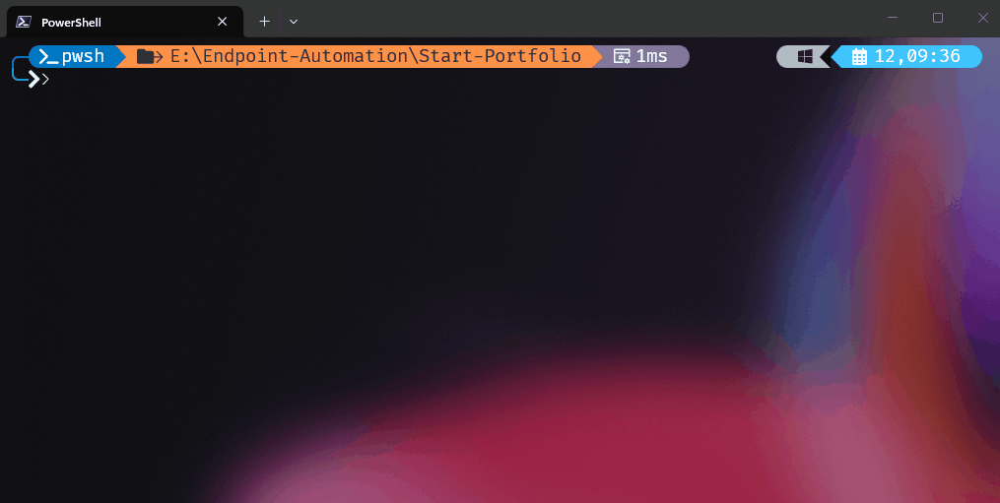

# David R. Cushman | Endpoint Engineering Portfolio

[Project Index](./projects/README.md) · [Project Selection Criteria](./docs/project-selection.md) · [Portfolio Roadmap](./docs/portfolio-roadmap.md)

## About Me

I build endpoint platforms and engineering foundations for Microsoft environments, with a focus on PowerShell automation, governance, and reliability.

I'm naturally drawn to deconstructing systems to understand how they work, where their abstractions end, and how they behave when things go wrong. Much of my recent PowerShell and AI-assisted engineering work has grown from that same approach: examining what it means to develop trustworthy automation, then turning what I learn into practical tools, standards, tests, and workflows.

## Reliable. Repeatable. Governable.

This portfolio shows how I approach engineering work that must be reliable in production, repeatable across teams and environments, and governable over time. It brings together reusable PowerShell foundations, applied endpoint work, and the documentation that explains the constraints and decisions behind it.

### Reliable

Engineering should produce systems that are dependable, verifiable, and safe to trust in production.

- if a step is not verified, it is not complete
- automation should reduce operational risk, not simply save time

### Repeatable

Engineering should produce results that remain consistent across operators, environments, and future maintenance.

- reusable engineering foundations should reduce environmental drift
- automation should remain maintainable throughout its lifecycle

### Governable

Engineering should remain understandable, reviewable, and maintainable as systems evolve.

- documentation should preserve engineering intent, not just implementation details
- automation should be guided by standards, validation, and explicit review boundaries

## How To Read This Portfolio

This portfolio is organized around practical engineering investigations in endpoint engineering and automation. Each featured repository explores the technologies, underlying mechanics, abstractions, constraints, and tradeoffs behind an operational problem.

The resulting implementation is intended to demonstrate that understanding rather than stand on its own as the claim. The code matters, but it is only part of the evidence. The documentation, architecture, ADRs, tests, CI, validation, and implementation choices collectively show how I approach engineering work.

Across the portfolio, that work is meant to demonstrate:

- reusable PowerShell engineering foundations for both PowerShell 7 and Windows PowerShell 5.1
- applied endpoint and automation work shaped by real operational constraints
- engineering judgment made visible through documentation, validation, and deliberate implementation decisions
- AI-assisted engineering governed by explicit review, validation, and maintenance boundaries

Rather than collecting every script or experiment, this portfolio focuses on a smaller number of projects that show how I investigate problems, make decisions, and build solutions that are practical, well-documented, and operationally useful.

If you want the quickest read, go straight to [Practical Engineering Investigations](#practical-engineering-investigations). Each case study explains the problem, constraints, implementation choices, and engineering signal behind the work.

## How I Use AI

AI is part of my engineering process, but it is not the source of engineering judgment.

I use AI as a drafting and reasoning accelerator throughout investigation, implementation, review, documentation, and maintenance. Repository instructions, task-specific skills, defined behavioral expectations, and repeatable interaction workflows provide boundaries for how AI participates in the work.

Those controls guide behavior; they do not prove that generated code is correct. AI-generated work is evaluated, challenged, and refined, then validated through engineering controls such as code review, PSScriptAnalyzer, Pester testing, CI, and observed system behavior. Tests and validation are themselves reviewed to ensure they provide meaningful evidence that the implementation satisfies the intended requirements.

The goal is to gain the speed and flexibility of AI assistance without delegating engineering accountability to it. Human judgment remains responsible for defining the problem, evaluating risk, deciding what good looks like, and determining whether the final result is correct, safe, maintainable, and worth keeping.

## What I Build

I build endpoint and automation solutions for environments where reliability matters, drift is expensive, and change has to be handled deliberately.

The work I am most drawn to sits at the intersection of:

- endpoint engineering at enterprise scale
- automation that reduces operational risk
- platform modernization across on-prem and cloud-connected tooling
- documentation and process design that make systems supportable over time

My approach to engineering was shaped early by work where mistakes could have immediate and irreversible consequences. That experience taught me to respect risk and consequences; IT taught me to build systems that anticipate failure and make it detectable, manageable, and recoverable.

## Background

My background includes enterprise endpoint engineering in financial services and energy infrastructure, with practical experience in:

- Configuration Manager (ConfigMgr / MECM / SCCM)
- Microsoft Intune and modern endpoint management
- Windows deployment and platform lifecycle engineering
- PowerShell automation
- Active Directory and Group Policy
- Microsoft 365, Azure, and security-aligned platform administration

Professional profile: [LinkedIn](https://www.linkedin.com/in/davidrcushman/).

## Practical Engineering Investigations

These repositories are selected practical engineering investigations into endpoint, automation, and platform problems. Each one is included not only for the working implementation, but for the engineering understanding, decisions, and evidence it helps make visible.

### [PowerShell Development Template: Available Anywhere](./projects/pwsh-dev-template.md)

A reusable PowerShell Core repository template with CI validation, Dev Containers, ADR-backed decisions, guidance sync, and template health reporting, built to investigate what a modern, governed PowerShell engineering baseline should include for portable development and long-term maintenance.

Best signal: reusable engineering standards, deterministic validation, and AI-governed maintenance workflows for modern PowerShell work.

Repository:
[pwsh-dev-template](https://github.com/david-r-cushman/pwsh-dev-template)

### [Windows PowerShell 5.1 Development Template](./projects/powershell-dev-template.md)

A reusable repository template for Windows PowerShell 5.1 with a native Windows development baseline, Windows-hosted CI, and the same testing, analysis, governance, and maintenance discipline as the modern PowerShell template, built to investigate how that rigor can be preserved for Windows-only work.

Best signal: runtime-aware engineering judgment for legacy and Windows-only PowerShell work without giving up validation discipline.

Repository:
[powershell-dev-template](https://github.com/david-r-cushman/powershell-dev-template)

### [Uninstall-DisplayDrivers](./projects/powershell-driver-management.md)

A PowerShell script recreated from a real ConfigMgr-based Windows 7 to Windows 10 in-place upgrade solution, modernized to reflect current scripting standards while preserving the operational deployment problem it originally solved with `devcon.exe`.

Best signal: practical ConfigMgr-oriented scripting shaped by real deployment constraints, safety guardrails, and operational reporting.

Repository:
[powershell-driver-management](https://github.com/david-r-cushman/powershell-driver-management)

### [WinPE Deployment Lab](./projects/winpe-deployment-lab.md)

Enterprise deployment tools such as MDT and ConfigMgr intentionally abstract significant deployment complexity. This repository investigates those underlying mechanics by working directly with WinPE, DISM, WIM servicing, unattended deployment, and deployment media creation, demonstrating that understanding through a practical deployment lab.

Best signal: hands-on platform depth in Windows imaging and offline servicing, with scoped automation that stays technically honest.

Repository:
[winpe-deployment-lab](https://github.com/david-r-cushman/winpe-deployment-lab)

### [GPU Cooldown Sleep](./projects/gpu-cooldown-sleep.md)

A PowerShell module built to investigate how hardware telemetry can safely drive automated operating system state changes by combining GPU temperature monitoring, configurable safety thresholds, and controlled Windows sleep behavior.

Best signal: disciplined module design that combines hardware telemetry, safe state changes, and testable operational UX.

Repository:
[gpu-cooldown-sleep](https://github.com/david-r-cushman/gpu-cooldown-sleep)

## Explore The Work

For a faster scan, use the links below to jump directly into the project evidence and supporting portfolio context.

- [Portfolio Project Index](./projects/README.md)
- [pwsh-dev-template Case Study](./projects/pwsh-dev-template.md)
- [powershell-dev-template Case Study](./projects/powershell-dev-template.md)
- [powershell-driver-management Case Study](./projects/powershell-driver-management.md)
- [winpe-deployment-lab Case Study](./projects/winpe-deployment-lab.md)
- [gpu-cooldown-sleep Case Study](./projects/gpu-cooldown-sleep.md)
- [Portfolio Roadmap](./docs/portfolio-roadmap.md)

## Usage Notice

This repository is provided for portfolio and evaluation purposes.

See [`NOTICE.md`](./NOTICE.md) for rights and usage details.
